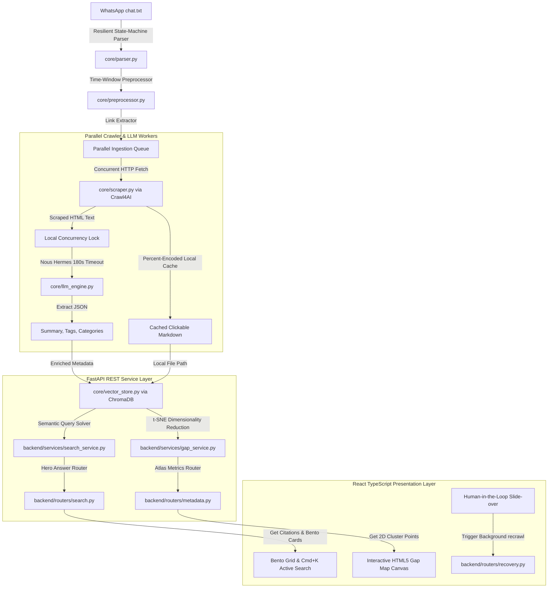

# 🧠 RAGnook: The Personal Memory & Web Context RAG Dashboard

[](https://www.python.org/)
[](https://www.typescriptlang.org/)
[](https://react.dev/)
[](https://fastapi.tiangolo.com/)
[](https://www.trychroma.com/)
[](https://opensource.org/licenses/MIT)

**RAGnook** is a high-density, beautifully aesthetic Apple/Linear-style **Retrieval-Augmented Generation (RAG) Personal Memory Dashboard**. It parses WhatsApp conversation logs, extracts shared links, scrapes dynamic web content via modern headless crawlers, processes articles through localized LLMs, indexes them into a local vector database, and presents the insights in an interactive, visual search interface.


---

## 🏗️ System Architecture



---

## 🌟 Core Features

- **Robust WhatsApp Log Parsing (TDD):** A resilient state-machine parser that normalizes dates, splits system messages, preserves multi-line paragraphs, and groups messages into time-windowed segments.
- **Dynamic Web Crawling (Crawl4AI):** Concurrently scrapes modern Javascript-rendered web articles, downloads/caches images locally using percent-encoding safe paths, and compiles clickable markdown files that link to their online sources.
- **Serialized LLM Inference Queue:** Employs a thread-safe client-side lock that schedules parallel crawling while queuing local LLM queries (Nous Hermes via LM Studio) sequentially, preventing slot bottlenecks and uvicorn timeouts on standard M1/GPU hardware.
- **High-Density Bento Dashboard:** A gorgeous Apple/Linear-style grid view featuring glassmorphic hover-citation cards, Prose vs. Data Mode grid toggles, and Z-axis spring hover card lifts that visually highlight matching categories.
- **2D Knowledge Gap Mapping:** Solves t-SNE dimensionality reduction on vector document embeddings with automatic perplexity scaling. Renders document clusters, glowing active nodes, and empty "knowledge voids" on an interactive Canvas to spot missing chat links.
- **Active Ingestion Slide-over:** Implements a Human-in-the-Loop curation queue to trigger background crawlers, displaying real-time step-by-step progress bars.
- **API Offline Resiliency:** Seamlessly falls back to rich mocked preview datasets if your local API server is offline, so you can interact with the frontend immediately.

---

## 🤝 Standing on the Shoulders of Giants

Insights Explorer would not be possible without the incredible open-source projects powering the modern web and local AI ecosystems:

### ⚡ Backend Core & Services
- **[FastAPI](https://github.com/tiangolo/fastapi):** Fast, asynchronous high-performance web routing framework.
- **[Uvicorn](https://github.com/encode/uvicorn):** Lightning-fast ASGI web server implementation.
- **[ChromaDB](https://github.com/chroma-core/chroma):** The AI-native, developer-first open-source local vector database.
- **[Crawl4AI](https://github.com/unclecode/crawl4ai):** High-fidelity, markdown-ready web scraping crawler built for AI agents.
- **[OpenAI Python SDK](https://github.com/openai/openai-python):** Seamless, standard JSON-compatible interface to local LLM engines.
- **[Nous Hermes 3 (Ollama/LM Studio)](https://github.com/NousResearch/Hermes-3):** A state-of-the-art open-source local LLM, ideal for long summarizations and robust structured metadata extraction.
- **[Scikit-Learn](https://github.com/scikit-learn/scikit-learn):** Provides the mathematical t-SNE dimensionality reduction solver used to map vector projections.
- **[Numpy](https://github.com/numpy/numpy):** High-performance vector arithmetic and array manipulation.

### 💻 React Presentation Layer
- **[React & TypeScript](https://github.com/facebook/react):** Fast, type-safe reactive UI components.
- **[Vite](https://github.com/vitejs/vite):** Next-generation frontend tooling and HMR dev compiler.
- **[Framer Motion](https://github.com/framer/motion):** Premium physics-based spring animations and layouts.
- **[Lucide Icons](https://github.com/lucide-icons/lucide):** Pixel-perfect, crisp, open-source vector icon libraries.

---

## 🚀 Getting Started

### 📋 Prerequisites
- **Node.js** (v18.0+) & **NPM**
- **Python** (v3.11+)
- **LM Studio** or **Ollama** running local Nous Hermes (or equivalent model compatible with OpenAI API specifications on `http://localhost:1234/v1`).

---

### 1. Backend Python Setup

1. Create a virtual environment and activate it:
   ```bash
   python -m venv .venv
   source .venv/bin/activate
   ```
2. Install python dependencies:
   ```bash
   pip install -r requirements.txt
   ```
3. Initialize the WhatsApp ingestion pipeline CLI locally:
   ```bash
   # Parses chat.txt log, crawls links, extracts summaries, and indexes into ChromaDB
   python main.py
   ```

---

### 2. Frontend React Setup

1. Navigate to the `frontend/` directory:
   ```bash
   cd frontend
   ```
2. Install npm dependencies:
   ```bash
   npm install
   ```
3. Verify the typescript production bundle compiles cleanly:
   ```bash
   npm run build
   ```

---

### 3. Concurrently Running Developer Services

We have written a unified development orchestrator that concurrency spins up both the FastAPI backend service and the Vite dev server locally. It binds a Unix process group exit trap so that a single `Ctrl+C` cleanly shuts down all background processes:

```bash
# From project root directory
chmod +x run_web.sh
./run_web.sh
```

- **Insights Explorer Dashboard:** `http://localhost:5173`
- **FastAPI API Server:** `http://localhost:8000`
- **Swagger Documentation:** `http://localhost:8000/docs`

---

## 🧪 Testing (TDD)

We maintain strict software craftsmanship through comprehensive test-driven development. Run our entire pytest suite (routers, preprocessors, scrapers, and local GPU thread locks):

```bash
PYTHONPATH=. .venv/bin/pytest
```

---

## 📄 License

Distributed under the MIT License. See [LICENSE](LICENSE) for more information.
