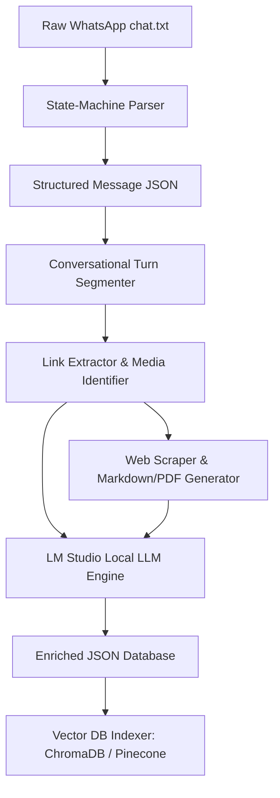

# MASTER SPECIFICATION & IMPLEMENTATION PROMPT
## Project: WhatsApp Chat Ingestion, Semantic Chunking, Web Scraper, and Local LLM Enrichment Engine

You are a world-class Data Engineer, Python Architect, and AI Systems Builder. Your objective is to build a highly robust, modular, and production-ready Python command-line application that ingests raw WhatsApp export text files, parses them, extracts URLs, scraps the web pages, converts them into Markdown and PDF formats, enriches them with summaries and tags using a local LLM server (LM Studio), and indexes them into a local Vector Database for RAG (Retrieval-Augmented Generation).

---

## 1. System Architecture Overview

The system processes WhatsApp data in two primary steps:
1. **Parsing & Clean Extraction (ETL Stage):** A robust regex-based state machine parses the text file, resolves multi-line messages, cleans noise, extracts media references, classifies senders, and segments conversational turns.
2. **Web Scraping & LLM Enrichment (Processing & Indexing Stage):** The application fetches links, scrapes main text content, exports them to Markdown and PDF files, queries a local **LM Studio** server (`http://localhost:1234/v1`) to enrich both messages and web resources with summaries and tags, and indexes the resulting chunks into a Vector Database.



---

## 2. Input Analysis & Technical Challenges

Your implementation must specifically address the following engineering challenges:

### A. Message Boundaries & Multi-line Parsing
WhatsApp chat exports format messages with a datetime header:
`M/D/YY, HH:MM - Sender Name: Content`
However, users frequently send multi-line messages, lists, or code snippets that contain newlines and lack the datetime prefix. 
*   **Solution:** Implement a line-by-line streaming parser using a state-machine pattern.
*   **Regex Pattern:** Match headers using `^(\d{1,2}/\d{1,2}/\d{2,4}),\s*(\d{1,2}:\d{2})\s*-\s*(.*)$`.
*   **State Machine:**
    *   If a line matches the regex, verify if the remainder matches `^([^:]+):\s*(.*)$` to separate the sender and content. If there is no sender prefix, classify it as a `System` message.
    *   If a line does not match the regex, it is a continuation of the active message. Append it to the previous message's content with a `\n` separator.

### B. Noise Removal & Filtering
Raw logs contain metadata messages (system encryption alerts, call logs, groups changes) and media placeholders.
*   **Actionable Rules:**
    *   Identify and flag system messages (e.g., lines containing `"Messages to yourself are end-to-end encrypted"`).
    *   Flag or exclude placeholders like `<Media omitted>` or empty lines.
    *   Do not discard system messages completely; label their `media_type` as `"system"` and set `sender` as `"System"`.

### C. Speaker Identification & Context Segmentation
*   Distinguish between specific senders (e.g., `'Idan P'` vs. others) using regex capture groups.
*   Ensure that the sender identity is normalized (e.g., trim whitespace, resolve synonyms, remove trailing colons).

### D. Bilingual Text Handling (Hebrew & English)
The chat file contains Hebrew text mixed with English terms, URLs, and emojis.
*   **Solution:** Ensure all file reads/writes use `utf-8` encoding explicitly.
*   **Bidi Support:** When printing to the terminal or building PDFs, handle right-to-left (RTL) text flows to avoid backwards lettering or alignment breakage.

### E. Mixed Media & Link Handling
*   Detect URLs in message content using a strict regex: `https?://[^\s]+`.
*   Identify image attachment names, e.g., `IMG-20220703-WA0000.jpg (file attached)`.
*   Rather than indexing raw URLs, extract them, scrape their target pages, use the LLM to summarize their purpose, and embed the **summary** alongside the URL to provide rich contextual RAG chunks.

### F. Conversational Flow & Smart Chunking
Fixed character chunking breaks logical flows. 
*   **Solution:** Use **Context-Aware Semantic Chunking**:
    1.  **Time-Based Grouping:** Group messages into the same segment if the time difference between consecutive messages is less than a configurable threshold (e.g., 2 hours) or if they occurred on the same day.
    2.  **Sender/Flow Splitting:** Create boundary blocks when a new topic starts or after a natural pause.

---

## 3. Detailed Implementation Plan (Five Mandatory Phases)

### Phase 1: Data Ingestion and Parsing (The ETL Stage)
1.  Read the raw WhatsApp export file (`chat.txt`) using stream-processing (lazy loading) to handle arbitrarily large files.
2.  Define the raw message object structure using Python dataclasses or Pydantic models.
3.  Each parsed message must output to a structured JSON object containing:
    *   `message_id` (UUID or sequential hash)
    *   `datetime_utc` (ISO 8601 string normalized to UTC)
    *   `sender` (string, e.g., `"Idan P"`, `"System"`)
    *   `text_content` (cleaned message string)
    *   `media_type` (enum: `"text"`, `"link"`, `"image"`, `"system"`, `"video"`, `"audio"`)
    *   `original_source` (raw text line from the file for audit trail)

### Phase 2: Data Cleaning and Preprocessing
1.  **Regex Entities Extractor:** Identify key entities in the text:
    *   **URLs:** Extract all `http` and `https` links.
    *   **Files:** Match attachment patterns like `(\w+-\d+-\w+-\d+\.\w+)\s*\(file attached\)`.
    *   **Book/Project Mentions:** Extract italicized text or items resembling titles (e.g. "Brave new world").
2.  **Clean Normalization:** Clean excessive spaces, double newlines, and remove leading/trailing WhatsApp symbols.
3.  **Turn Segmenter:** Assemble individual messages into continuous "Conversational Turns" or "Segments" based on a maximum time delta of 2 hours. If a single sender posts multiple short notes within minutes, group them into a single coherent thought block.

### Phase 3: Indexing and Chunking Strategy
1.  **Context-Aware Chunking:**
    *   Instead of dividing text by strict character counts, write a custom chunker that splits data by **Conversational Segments**.
    *   Each chunk should consist of a single segment or a group of consecutive segments totaling between 500 and 1000 tokens.
    *   Prepend a metadata block to each chunk (e.g., `"[Date: 2024-03-01 | Sender: Idan P | Context: Notes] Message Content..."`) to preserve context.
2.  **Embedding Model Selection:**
    *   Recommend a localized model suitable for conversational or bilingual data, such as `sentence-transformers/all-MiniLM-L6-v2` or `intfloat/multilingual-e5-base` (for high-quality Hebrew and English embedding representation).
3.  **Vector Database Setup:**
    *   Use **ChromaDB** as the default local, lightweight vector database.
    *   Define a robust metadata schema to store alongside the embeddings:
        ```json
        {
          "sender": "Idan P",
          "start_date": "2024-03-01T06:56:00Z",
          "end_date": "2024-03-01T11:44:00Z",
          "has_links": true,
          "media_types": ["text", "image"],
          "tags": ["personal-chores", "shopping", "gift-ideas"]
        }
        ```
    *   Implement metadata filtering so users can query, for example, only messages sent by "Idan P" containing links.

### Phase 4: Web Scraping & Multi-Format Document Generation
For every unique URL extracted in Phase 2:
1.  **Resilient Scraper:** Implement a scraping service using `requests` and `BeautifulSoup` (or `trafilatura` for clean main-article extraction). Include a desktop User-Agent, handles HTTP retries, timeouts, and respects `robots.txt`.
2.  **Markdown Generation:** Convert the extracted HTML body to clean, readable Markdown (using libraries like `markdownify` or custom text compilation). Save to `output/scraped_pages/<hash_or_slug>.md`.
3.  **PDF Generation:** Convert the page content to a clean, formatted PDF using `reportlab`, `fpdf2`, or `pdfkit`/`weasyprint`. Ensure proper word wrapping and margins. Save to `output/scraped_pages/<hash_or_slug>.pdf`.
4.  **Error Resilience:** If a link is private (e.g., GitHub private repo, Spotify login screen, YouTube video page without JS), capture the metadata (title, status code) and gracefully flag the scraping as `"partial"` or `"failed"`, rather than halting execution.

### Phase 5: Local LLM Enrichment (LM Studio Integration)
Integrate with an LM Studio server running on `http://localhost:1234/v1`.
1.  **Connection Manager:** Use the official `openai` Python SDK, pointing `base_url` to `http://localhost:1234/v1` and using a dummy API key (`api_key="lm-studio"`).
2.  **Webpage Summarizer:** Send the scraped web page's Markdown content to the local LLM to generate an executive summary (max 150 words) and a list of key insights.
3.  **Message & Segment Enricher:** For each conversational segment:
    *   Request the LLM to generate a single-sentence **Executive Summary**.
    *   Request the LLM to output a list of **Tags** (e.g., `["Development", "Reading List", "Rome Travel", "AI Tools"]`).
    *   Use **Structured Outputs** (JSON mode or precise system prompts with Schema declarations) to get valid JSON from the LLM, ensuring seamless integration.

---

## 4. Proposed Application Directory Structure

Your generated application should follow this modular design:

```
whatsapp-enricher/
│
├── requirements.txt         # All external dependencies
├── main.py                  # CLI Orchestrator & entrypoint
├── config.py                # Configuration and hyperparameter settings
│
├── core/
│   ├── __init__.py
│   ├── parser.py            # WhatsApp parser & state machine
│   ├── preprocessor.py      # Cleaning, Regex extractor, turn segmenter
│   ├── scraper.py           # Web scraping & Markdown/PDF generators
│   ├── llm_engine.py        # LM Studio API client & structured prompts
│   └── vector_store.py      # ChromaDB setup and embedding operations
│
└── output/                  # Generated artifacts
    ├── parsed_chat.json     # Final enriched JSON file
    ├── scraped_pages/       # Folder for all scraped web pages
    │   ├── abc123_youtility.md
    │   └── abc123_youtility.pdf
    └── vector_db/           # ChromaDB database directory
```

---

## 5. Technical Specifications & Reference Code

### A. Python Dependencies (`requirements.txt`)
Ensure the application uses the following libraries:
```text
openai>=1.0.0
pydantic>=2.0.0
requests>=2.31.0
beautifulsoup4>=4.12.0
trafilatura>=1.6.0
markdownify>=0.11.0
fpdf2>=2.7.0
chromadb>=0.4.0
rich>=13.0.0
urllib3>=2.0.0
```

### B. Core WhatsApp Parser State Machine (`core/parser.py`)
Below is the reference pattern for parsing multi-line WhatsApp exports:

```python
import re
from datetime import datetime
from dataclasses import dataclass
from typing import List, Optional

@dataclass
class RawMessage:
    date_str: str
    time_str: str
    sender: str
    content: str
    raw_text: str

class WhatsAppParser:
    def __init__(self):
        # Match pattern: "M/D/YY, HH:MM - "
        self.message_start_regex = re.compile(r"^(\d{1,2}/\d{1,2}/\d{2,4}),\s*(\d{1,2}:\d{2})\s*-\s*(.*)$")

    def parse_file(self, filepath: str) -> List[RawMessage]:
        messages = []
        current_msg: Optional[RawMessage] = None

        with open(filepath, "r", encoding="utf-8") as f:
            for line in f:
                line_str = line.strip("\n")
                match = self.message_start_regex.match(line_str)
                
                if match:
                    # Save the previous message if it exists
                    if current_msg:
                        messages.append(current_msg)
                    
                    date_str, time_str, remainder = match.groups()
                    
                    # Split sender and content
                    sender_match = re.match(r"^([^:]+):\s*(.*)$", remainder)
                    if sender_match:
                        sender = sender_match.group(1).strip()
                        content = sender_match.group(2).strip()
                    else:
                        sender = "System"
                        content = remainder.strip()
                        
                    current_msg = RawMessage(
                        date_str=date_str,
                        time_str=time_str,
                        sender=sender,
                        content=content,
                        raw_text=line_str
                    )
                else:
                    # Continuation line (multi-line message)
                    if current_msg:
                        current_msg.content += "\n" + line_str
                        current_msg.raw_text += "\n" + line_str
            
            # Don't forget the last message
            if current_msg:
                messages.append(current_msg)
                
        return messages
```

### C. PDF Generation with RTL/Bilingual support (`core/scraper.py`)
When rendering scraped web text, ensure paragraphs are cleanly structured in PDF. Here is a baseline configuration using `fpdf2`:

```python
from fpdf import FPDF

class CleanPDF(FPDF):
    def header(self):
        self.set_font('helvetica', 'B', 12)
        self.cell(0, 10, 'Scraped Content Report', border=0, new_x="LMARGIN", new_y="NEXT", align='C')
        self.ln(5)

    def footer(self):
        self.set_y(-15)
        self.set_font('helvetica', 'I', 8)
        self.cell(0, 10, f'Page {self.page_no()}', 0, 0, 'C')

def create_pdf_from_text(title: str, content: str, output_path: str):
    pdf = CleanPDF()
    pdf.add_page()
    pdf.set_font("helvetica", size=10)
    
    # Title
    pdf.set_font("helvetica", "B", 16)
    pdf.multi_cell(0, 10, txt=title)
    pdf.ln(10)
    
    # Body Content
    pdf.set_font("helvetica", size=10)
    # Clean non-ascii/UTF-8 characters for standard PDF fonts if not using custom TrueType fonts
    clean_content = content.encode('ascii', 'ignore').decode('ascii')
    pdf.multi_cell(0, 6, txt=clean_content)
    
    pdf.output(output_path)
```
*(Note: Recommend incorporating TrueType fonts (like Arial or Noto Sans) in your implementation if full Hebrew RTL support in the generated PDFs is desired).*

### D. LM Studio Server API Client (`core/llm_engine.py`)
Ensure your connector operates using the modern `openai` client package structure:

```python
from openai import OpenAI
import json

class LMStudioClient:
    def __init__(self, api_url: str = "http://localhost:1234/v1"):
        # LM Studio behaves like OpenAI server, but runs locally and requires no real API key
        self.client = OpenAI(base_url=api_url, api_key="lm-studio")
        self.model_name = "local-model"  # LM Studio automatically uses the currently loaded model

    def summarize_text(self, text: str) -> str:
        prompt = f"Provide a brief, concise summary (max 150 words) of the following web page content:\n\n{text}"
        response = self.client.chat.completions.create(
            model=self.model_name,
            messages=[
                {"role": "system", "content": "You are an expert summarizer and research analyst."},
                {"role": "user", "content": prompt}
            ],
            temperature=0.3
        )
        return response.choices[0].message.content.strip()

    def enrich_message_segment(self, segment_text: str) -> dict:
        prompt = (
            "Analyze the following conversation segment. Output a JSON object containing "
            "an 'executive_summary' (one sentence) and 'tags' (a list of 3-5 tags representing topics/entities).\n"
            f"Segment:\n{segment_text}\n\n"
            "Format your response EXACTLY as a valid JSON object: {\"executive_summary\": \"...\", \"tags\": [\"...\", \"...\"]}"
        )
        
        response = self.client.chat.completions.create(
            model=self.model_name,
            messages=[
                {"role": "system", "content": "You are a data enrichment assistant. You ONLY output valid JSON block."},
                {"role": "user", "content": prompt}
            ],
            temperature=0.2,
            response_format={"type": "json_object"}  # Enforce JSON mode if supported by the model/server
        )
        
        try:
            return json.loads(response.choices[0].message.content.strip())
        except Exception:
            # Fallback parser if JSON mode fails
            raw = response.choices[0].message.content.strip()
            # Basic cleaning to extract JSON substring if there is surrounding markdown wrap
            json_match = re.search(r"\{.*\}", raw, re.DOTALL)
            if json_match:
                return json.loads(json_match.group(0))
            return {"executive_summary": "Failed to parse summary", "tags": ["error"]}
```

---

## 6. Verification & Output Deliverables

To prove that the pipeline functions perfectly:
1.  **Parse Result verification:** Verify that every multi-line list (like the shopping/packing lists under `Idan P`) is parsed as a single item with line breaks, not as separate messages with missing dates.
2.  **Web Scraping Reports:** Check that Markdown and PDF documents are generated for each unique link and stored correctly in `output/scraped_pages/`.
3.  **Local LLM Outputs:** Inspect `output/parsed_chat.json` to verify that every message chunk contains a generated `'executive_summary'` and list of `'tags'` supplied by the LM Studio model.
4.  **Vector Store Validation:** Query ChromaDB with a prompt like `"Show me links related to GitHub tools or photo editors"` and ensure it successfully returns the enriched web summary metadata.

---

**Generate the complete code matching these design patterns, structuring your files logically, including comments, type annotations, and a terminal user experience built with the `rich` library.**
