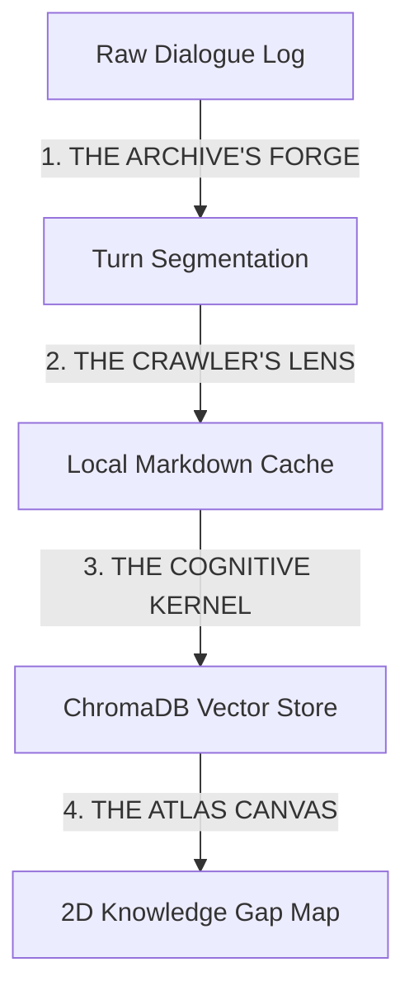

# RAGnook: Brand Narrative & Copywriting Guide

*"Optimized for Privacy. Engineered for Insight."*

This document establishes the digital identity, brand positioning, and high-impact copy architecture for **RAGnook**—the private, offline semantic notebook workspace for your chats and links.

---

## 🗺️ Architectural Philosophy Overview

---

## 🛠️ Section-by-Section Narrative Architecture

### 1. THE ARCHIVE'S FORGE (`#archive-forge`)
**Objective:** Communicate the transformation of messy, unstructured conversation exports into high-fidelity, segmented dialogue structures.
**Key Themes:** Resilient parsing, chronological turn segmentation, turning noise into data.

*   **Headline:** *"The Alchemy of Dialogue"*
*   **Subheadline:** *"Shattered paragraphs. Multiline logs. Re-assembled into a perfect, structured timeline of your life."*
*   **Body Copy:**
    > Most see chat exports as throwaway noise. We see them as the raw substrate of your personal intelligence.
    > The Forge is where unstructured text meets mathematical order.
    > A TDD-backed state-machine parser meticulously sanitizes raw logs, isolates system interruptions, preserves multiline context, and groups dialogue into time-windowed chronological segments.
    > This isn't archiving. It's **semantic recovery**.
*   **Interactive Parser Log Copy:**
    - `[RAW INPUT]`  `"3/1/24, 06:56 - Idan P: מצעים \n פחים \n בקבוק שווה לאלון"`
    - `[STATE]`      `Parsing multiline buffer...`
    - `[PROCESSED]`  `turn_id: seg-042 | Sender: Idan P | Language: HE/EN | Segments: 1`
    - `[CACHED]`     `Turn synchronized. Chronological integrity verified.`
*   **Microcopy & Metadata:**
    - Monospace details: `Parser: State-Machine V1.2 | Encoding: UTF-8 | Format: Chronological-Turn-Window`
    - CTA: *"Hover to reveal the parsed metadata tags beneath the raw text."*

---

### 2. THE CRAWLER'S LENS (`#crawlers-lens`)
**Objective:** Showcase the precision of headless parallel web crawling and local percent-encoded asset caching.
**Key Themes:** Local-first caching, percent-encoded visual persistence, rendering web context offline.

*   **Headline:** *"Crawl Local. Cache Forever."*
*   **Subheadline:** *"No dead links. No cloud tracking. The web, frozen in markdown and kept entirely on your machine."*
*   **Body Copy:**
    > The internet is fluid; pages die, URLs change, and trackers follow. RAGnook halts the decay.
    > The Lens concurrently crawls modern, Javascript-rendered articles shared in your chats.
    > It extracts clean markdown and downloads remote images using safe, percent-encoded local file paths.
    > Every document is preserved in its absolute, high-fidelity state—private, permanent, and searchable without internet.
*   **Before/After Slider Copy:**
    - **Cloud Webpage:** *"Dynamic scripts. Cookie walls. Data-harvesting trackers."*
    - **Local Cache:** *"Clean markdown. Cached graphics. Evidence-grade private context."*
*   **Asset Compiler Metadata:**
    - `Compiler: Crawler-Ready Crawl4AI | Image Cache: Percent-Encoded Safe-Path | Status: STATIC-OFFLINE`
    - CTA: *"Slide to strip away the trackers and view raw, readable offline markdown."*

---

### 3. THE COGNITIVE KERNEL (`#cognitive-kernel`)
**Objective:** Illustrate the serial inference pipeline, thread-safe model management, and vector DB indexing.
**Key Themes:** Sequential inference queues, uvicorn stability, local semantic indexing.

*   **Headline:** *"Inference Behind Locked Doors"*
*   **Subheadline:** *"Nous Hermes 3. Thread-safe scheduling. ChromaDB vector indexing. Local GPU horsepower, fully optimized."*
*   **Body Copy:**
    > Cloud LLMs leak data. Local LLMs crash when hit with parallel scraper threads.
    > The Kernel solves both. It locks inference in a secure, thread-safe queue, processing pages sequentially to protect standard consumer hardware from GPU uvicorn bottlenecks.
    > Webpages and chat segments are parsed through local LLM engines (Nous Hermes via LM Studio) to extract high-density summaries, tags, and categories.
    > These summaries are dynamically indexed into ChromaDB—building a hyper-performant, private retrieval engine.
*   **Queue Lifecycle Log Copy:**
    - `[CRAWL QUEUE]` `4 Thread Parallel Crawl (Active)`
    - `[LLM LOCK]`    `Thread-Safe Concurrency Lock: [HELD]`
    - `[INFERENCE]`   `Prompting Nous Hermes serially (180s Timeout Guard)`
    - `[DATABASE]`    `Idempotent vector upsert into collection: 'whatsapp_chat'`
*   **Vector Engine Metadata:**
    - Monospace details: `Embeddings: Nomic-Embed-Text | Vector DB: Chroma DB V0.4 | LLM: local/Nous-Hermes-8B`
    - CTA: *"Click to view the prompt templates that frame your memories."*

---

### 4. THE ATLAS CANVAS (`#atlas-canvas`)
**Objective:** Highlight the high-density Apple/Linear-style Bento Grid and interactive 2D t-SNE dimensionality maps.
**Key Themes:** t-SNE coordinate math, visual knowledge voids, high-density Bento grid interfaces.

*   **Headline:** *"Mapping the Gaps in Your Mind"*
*   **Subheadline:** *"Bento citation layouts. Glowing active nodes. t-SNE cluster coordinates. A geographic atlas of what you know."*
*   **Body Copy:**
    > Memory isn't a list; it's a map.
    > The Canvas runs dimensional t-SNE calculations over your vector embeddings, plotting your chat context onto a 2D map.
    > It highlights dense clusters of shared topics and visually exposes "knowledge voids"—empty spaces on the canvas where links were shared but never scraped.
    > Surrounding this, a glassmorphic Bento Grid displays hover-citations and prose search results, turning old conversations into an active dashboard.
*   **Canvas Point Metadata:**
    - `Coordinate: [x: 0.74, y: -0.12] | Category: Software Development | Tags: cpp, image-processing`
    - `Status: DANGLING_LINK | Action Needed: Trigger background crawl`
*   **Interface Metadata:**
    - Monospace details: `Renderer: HTML5 Canvas | Projection: t-SNE Perplexity-Scaling | Theme: Dark-Glassmorphism`
    - CTA: *"Drag the viewport to explore the voids in your knowledge atlas."*
