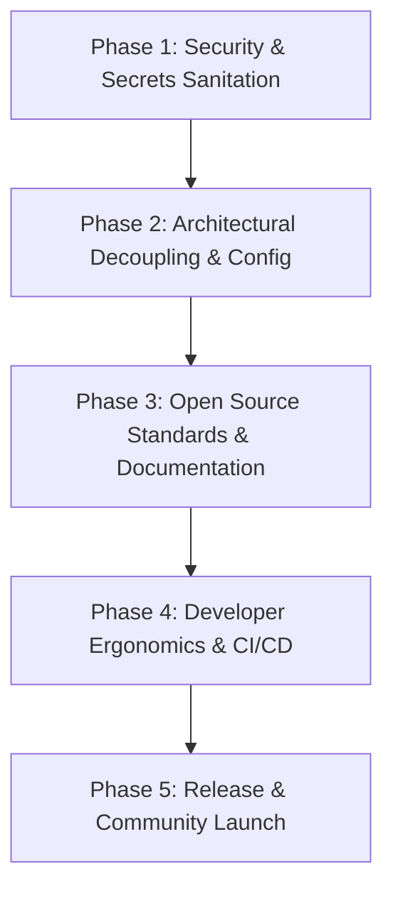

# Open Source Release Plan: Personal Memory

This document outlines a professional, production-grade roadmap to transform the local **Personal Memory** codebase into a high-quality, secure, and developer-friendly public open-source project on GitHub.

Acting as a principal software architect and open-source professional, this plan is structured into five distinct phases, ensuring absolute security, robust software design, developer ergonomics, and community readiness.

---

## 🗺️ Architectural Phase Overview



---

## 🛡️ Phase 1: Security & Secrets Sanitation (Critical Priority)
Before making the repository public, we must guarantee that absolutely no private data, keys, or local user paths are committed.

### 1. Hardened Git Ignore (`.gitignore`)
Expand [.gitignore](file:///Users/idaneyal/DEV/personal_momory/.gitignore) to ensure all runtime artifacts, local configs, and caches are never pushed:
```git
# Prevent pushing user's personal chat data
chat.txt
output/
scratch/

# Prevent settings files and local SQLite/Chroma DB files
*.db
*.sqlite
lms_settings.json
pipeline_tasks.json
parsed_chat.json

# Local env secrets
.env
.env.local
```

### 2. Git History Audit and Scrubbing
If personal chats or API keys were committed in previous git history:
*   Use `git-filter-repo` (recommended by Git over `filter-branch`) or `BFG Repo-Cleaner` to completely scrub files like `chat.txt`, `pipeline_tasks.json`, or hardcoded API keys from your entire commit history:
    ```bash
    git filter-repo --invert-paths --path chat.txt
    git filter-repo --invert-paths --path output/
    ```

### 3. Secret Scanner Integration
*   Integrate **TruffleHog** or **git-secrets** locally to scan commits for high-entropy strings, passwords, and API keys before allowing a push.

---

## ⚙️ Phase 2: Architectural Decoupling & Configuration
To make the software useful to other developers, we must remove local machine coupling and provide standard configuration mechanisms.

### 1. Dynamic Path Resolution
*   **The Problem**: Code currently contains absolute paths tied to your machine (e.g., `/Users/idaneyal/...`).
*   **The Fix**: Refactor config and service initializations to resolve paths dynamically relative to the application's root directory or user-defined env vars:
    ```python
    # Dynamic runtime paths
    BASE_DIR = Path(__file__).parent.resolve()
    OUTPUT_DIR = BASE_DIR / "output"
    ```

### 2. Environment Variables & `.env.example`
*   Create a [.env.example](file:///Users/idaneyal/DEV/personal_momory/ .env.example) template file outlining all supported configuration flags:
    ```ini
    # Core LLM Endpoint Settings
    LLM_BASE_URL=http://localhost:1234/v1
    LLM_API_KEY=lm-studio
    LLM_MODEL_NAME=google/gemma-4-e2b
    
    # Scraper & Workers
    MAX_SCRAPER_WORKERS=4
    LMS_SDK_ENABLED=True
    ```
*   Refactor [config.py](file:///Users/idaneyal/DEV/personal_momory/config.py) to read from `.env` using standard libraries like `python-dotenv` or Pydantic's `SettingsConfigDict`.

---

## 📖 Phase 3: Open Source Standards & Documentation
Great open-source repositories are defined by their documentation. We need to make it extremely easy for a new developer to understand, install, and run the project.

### 1. A Stunning `README.md`
A high-impact landing page containing:
*   **Catchy visual headers** and clear value propositions (e.g., "Personal Memory: Build a local, offline semantic RAG search index over your private WhatsApp chats").
*   **Architecture Diagram**: A visual flow chart showing the ETL pipeline (Parser ➡️ Scraper ➡️ LLM Enrichment ➡️ ChromaDB Vector Store).
*   **Quick Start Guide**: Single-line commands to set up LM Studio, parse chats, and start the GUI.
*   **Feature Highlights**: Time-based chronological segmentation, resilient parsing recovery, t-SNE Knowledge Gap visualization.

### 2. Legal & Licensing
*   Add a standard **MIT License** or **Apache 2.0 License** file in the root. The MIT License is highly recommended for developers seeking maximum adoption and open-source collaboration.

### 3. Contribution Guidelines (`CONTRIBUTING.md`)
*   Outline how developers can help improve the code.
*   Define coding style requirements (PEP 8, standard linting).
*   Set up step-by-step setup guides for running unit tests locally.

### 4. GitHub Community Templates
Create a `.github/` folder containing standard templates:
*   `ISSUE_TEMPLATE/bug_report.md`
*   `ISSUE_TEMPLATE/feature_request.md`
*   `PULL_REQUEST_TEMPLATE.md`

---

## 🤖 Phase 4: Developer Ergonomics & CI/CD
Automate checks so that external contributions do not break your codebase.

### 1. GitHub Actions Workflows
Set up `.github/workflows/tests.yml` to automatically run tests on every Push or Pull Request:
```yaml
name: Test Suite

on: [push, pull_request]

jobs:
  test:
    runs-on: ubuntu-latest
    steps:
      - uses: actions/checkout@v4
      - name: Set up Python
        uses: actions/setup-python@v5
        with:
          python-version: '3.11'
      - name: Install dependencies
        run: |
          pip install -r requirements.txt
      - name: Run Tests
        run: pytest
```

### 2. Pre-Commit Hook Automations
*   Integrate `.pre-commit-config.yaml` to enforce code standard checks (formatting and linting) locally before committing:
    *   **Black**: For unified Python code formatting.
    *   **Flake8**: For linting and syntax compliance.
    *   **isort**: For sorting imports cleanly.

---

## 🚀 Phase 5: Release & Community Launch
Once the code is clean, documented, and protected, we deploy!

### 1. Versioning Strategy
*   Adopt **Semantic Versioning 2.0.0** (`MAJOR.MINOR.PATCH`).
*   Tag your first release as `v1.0.0-beta` or `v1.0.0`.

### 2. The Launch Checklist
- [ ] Verify TruffleHog scanner returns 0 secret leaks.
- [ ] Confirm all unit tests pass locally and in GitHub Actions.
- [ ] Push clean code to a fresh public repository.
- [ ] Write an introductory GitHub Release note.
- [ ] *Optional*: Share the project in relevant local-first AI and developer communities (e.g., Reddit `r/LocalLLaMA`, Hacker News, show HN).
